<p align="center">
  
</p>

<h1 align="center">SSE DevTools Panel</h1>

<p align="center">
  <em>SSE / EventSource / NDJSON debugger for Chromium DevTools (Chrome &amp; Edge)</em>
</p>

<p align="center"><a href="./README.zh-CN.md">中文</a></p>

<p align="center">
  <strong>A Chromium extension to debug SSE / EventSource / NDJSON streams in DevTools.</strong><br/>
  After install, open F12 → SSE DevTools to inspect events, conversation, timeline, and global search.<br/>
  Built for long-lived streams such as AI chats, notifications, and progress updates.
</p>

<p align="center">
  <a href="https://fatmii.github.io/sse-devtools-panel/"></a>
  &nbsp;
  <a href="https://chromewebstore.google.com/detail/sse-devtools-panel/kffpkefnkmabnkhklmnjkihiiclggnni"></a>
  &nbsp;
  <a href="https://microsoftedge.microsoft.com/addons/detail/sse-devtools-panel/jmdceeplcpkajkiaiankkabblekdehmf"></a>
  &nbsp;
  <a href="https://github.com/FatMii/sse-devtools-panel/actions/workflows/ci.yml"></a>
  &nbsp;
  <a href="./CHANGELOG.md"></a>
  &nbsp;
  <a href="./LICENSE"></a>
  &nbsp;
  <a href="#"></a>
  &nbsp;
  <a href="#"></a>
</p>

<p align="center">
  <a href="https://fatmii.github.io/sse-devtools-panel/"><strong>Website</strong></a>
  ·
  <a href="./CHANGELOG.md"><strong>Changelog</strong></a>
  ·
  <a href="https://chromewebstore.google.com/detail/sse-devtools-panel/kffpkefnkmabnkhklmnjkihiiclggnni"><strong>Install from Chrome Web Store</strong></a>
  ·
  <a href="https://microsoftedge.microsoft.com/addons/detail/sse-devtools-panel/jmdceeplcpkajkiaiankkabblekdehmf"><strong>Install from Edge Add-ons</strong></a>
</p>

---

<p align="center">
  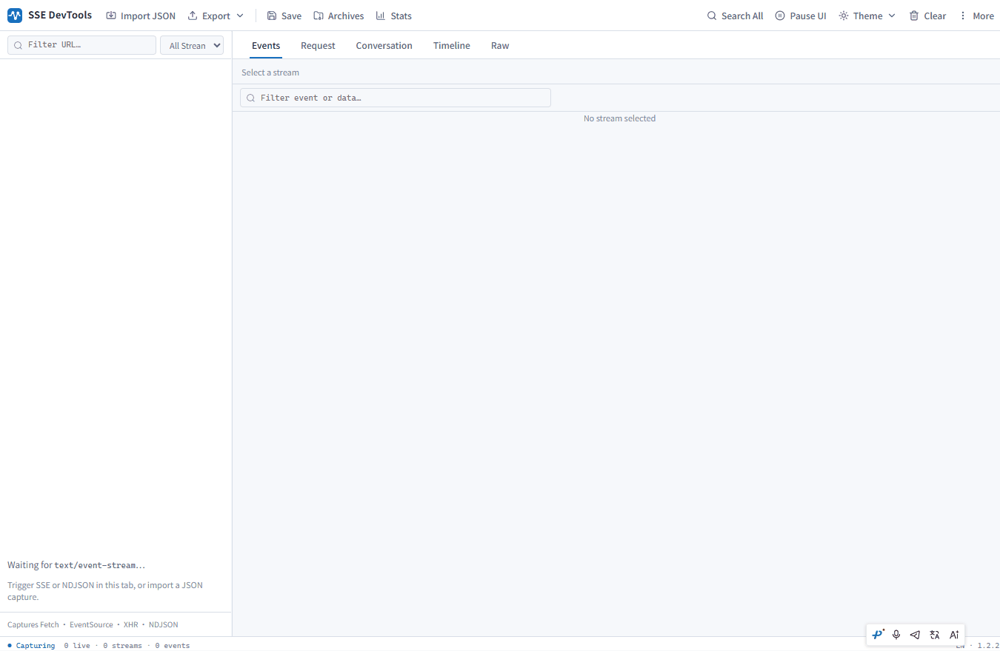
</p>

---

# Table of contents

- [Table of contents](#table-of-contents)
- [Why you need it](#why-you-need-it)
- [What it is / is not](#what-it-is--is-not)
- [Features](#features)
  - [🎣 Stream capture](#-stream-capture)
  - [📚 Streams sidebar](#-streams-sidebar)
  - [📋 Events](#-events)
  - [📨 Request](#-request)
  - [🧠 Conversation](#-conversation)
  - [⏱ Timeline](#-timeline)
  - [📄 Raw](#-raw)
  - [⚡ Virtual scrolling](#-virtual-scrolling)
  - [🛠 Analysis & toolbar](#-analysis--toolbar)
  - [💾 Import / export / archives](#-import--export--archives)
  - [🌐 i18n & settings](#-i18n--settings)
- [Screenshots](#screenshots)
  - [Main workbench](#main-workbench)
  - [Night theme](#night-theme)
  - [Toolbar & More menu](#toolbar--more-menu)
  - [Demo page](#demo-page)
- [Supported AI web vendors](#supported-ai-web-vendors)
- [Quick start](#quick-start)
  - [Prerequisites](#prerequisites)
  - [Install & load](#install--load)
- [30-second demo](#30-second-demo)
- [Development](#development)
- [Limitations](#limitations)
- [Changelog](#changelog)
- [Contributing](#contributing)
- [Acknowledgments](#acknowledgments)
- [License](#license)

---

# Why you need it

Chrome Network already has an [EventStream](https://developer.chrome.com/docs/devtools/network/reference#analyze-events-in-a-stream) tab for **standard SSE** (alongside Headers / Response), so you can watch events arrive while the stream is open.

For many AI / product streams that is not enough. They are often not plain EventSource, and common pain points are:

- Most use **`fetch` + custom SSE / NDJSON / Connect+JSON**. The EventStream tab is built for standard SSE, so Network mostly shows a whole Response body without a per-event view
- **Only total request duration** — first-byte delay, chunk gaps, stalls, and reconnects are not called out on their own
- **Chat is scattered in raw frames** — thinking / content / tool calls mix in raw data, so you reassemble a reply by hand

| Scenario                                        | Chrome Network                 | SSE DevTools Panel                                |
| ----------------------------------------------- | ------------------------------ | ------------------------------------------------- |
| Standard SSE (EventSource / some fetch)         | EventStream tab on the request | Same view, plus filters, JSON tree, export        |
| AI / vendor protocols (NDJSON, Connect+JSON, …) | Mostly a whole Response body   | Profile detection + **Conversation** channels     |
| In-stream timing & stalls                       | Mostly whole-request duration  | Timeline + Stats (TTFT / gap / events·s)          |
| Spec & anomalies                                | No targeted scan               | SSE Spec warnings · Anomalies                     |
| Web search / tool results                       | Buried in raw                  | Normalized `web_search` cards (queries + sources) |

---

# What it is / is not

**SSE DevTools Panel is**

- A dedicated Chromium **DevTools panel** (F12 → SSE DevTools)
- A stream debugging workbench: list · timing · request · conversation · export / replay

**SSE DevTools Panel is not**

- A replacement for the Network panel (full Headers audit still belongs in Network)
- A general packet sniffer / MITM proxy

---

# Features

- **Night theme** — toolbar switch for Light / Night / Follow DevTools (preference saved in Chrome sync; Options page unchanged)

## 🎣 Stream capture

- **Transports** — streams started with `fetch`, `EventSource`, or `XHR`
- **Formats** — SSE (`text/event-stream`), NDJSON, Connect+JSON
- **Independent view** — the panel can read stream content without changing page behavior
- **Lifecycle** — records abort, errors, close reasons, plus EventSource reconnects and `Last-Event-ID`
- **Fewer false positives** — a response appears in the sidebar only after it is confirmed as streaming content, so ordinary JSON / analytics requests are less likely to clutter the list

## 📚 Streams sidebar

- Live list of streams captured on the page: method, URL, status, event count
- Filter by URL search and transport (All / Fetch / EventSource / XHR)
- Shows matched vs total count after filtering
- Sidebar width is resizable

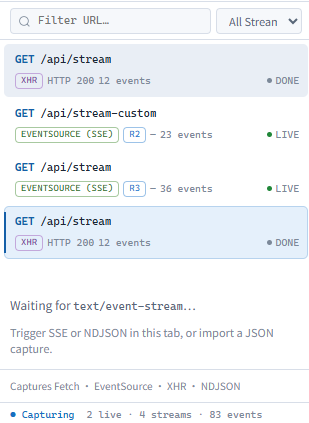

## 📋 Events

Inspect stream events row by row: index, arrival time, event name, data summary.

- **Virtual scrolling** — as the list grows, only on-screen rows are drawn, so scrolling stays steadier
- Click a row to expand JSON (collapsible)
- Filter event / data with text or regex
- Column widths are resizable
- Jump to matching rows from Timeline / Raw

<p align="center">
  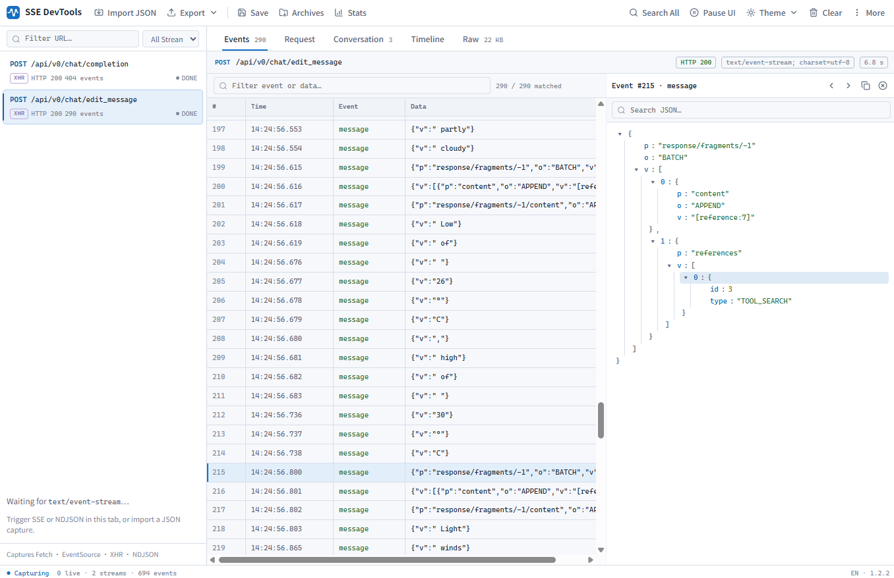
</p>

## 📨 Request

Inspect the request for the selected stream (similar to Network):

- Request headers and body
- Common sensitive headers redacted automatically (e.g. `Authorization` / `Cookie` / `*token*` / `*api-key*`; uncommon custom names may not be covered)
- Shown together with method, URL, status, and other basics

<p align="center">
  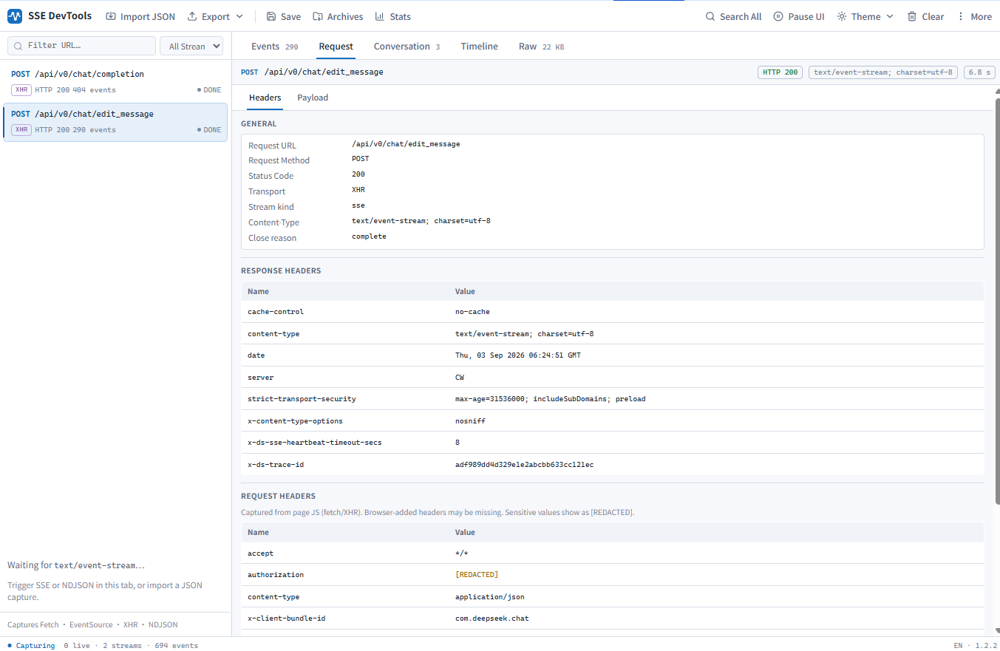
</p>

## 🧠 Conversation

Merge stream fragments into a readable conversation, split by channel:

| Channel      | What you see                                            |
| ------------ | ------------------------------------------------------- |
| **Content**  | Final answer                                            |
| **Thinking** | Thinking / deep-search process                          |
| **Tools**    | Function calls; web search becomes query + source cards |
| **Meta**     | Finish reason, usage, model, protocol type, and more    |

- Top chips show the detected protocol and site hint
- Tool cards are collapsible; web search shows query chips and result lists (title / URL / snippet)
- **Virtual scrolling** — longer Content / Thinking text is not dumped into the page all at once
- One-click copy for the current channel
- Most major Chinese AI web apps and OpenAI-compatible APIs can be merged (see the [support matrix](#supported-ai-web-vendors) below)

<p align="center">
  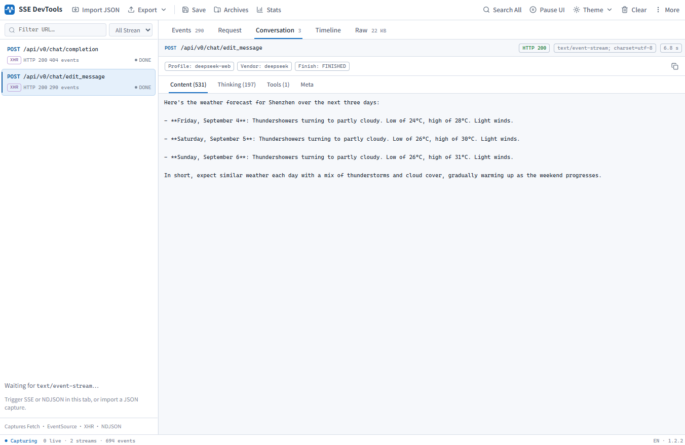
</p>

<p align="center">
  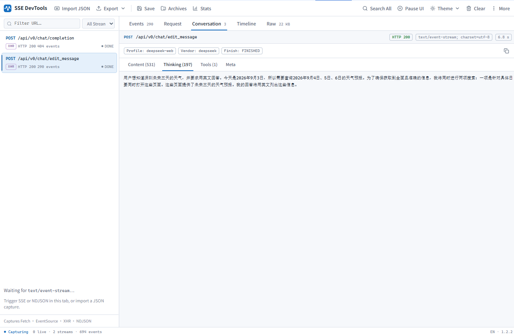
</p>

<p align="center">
  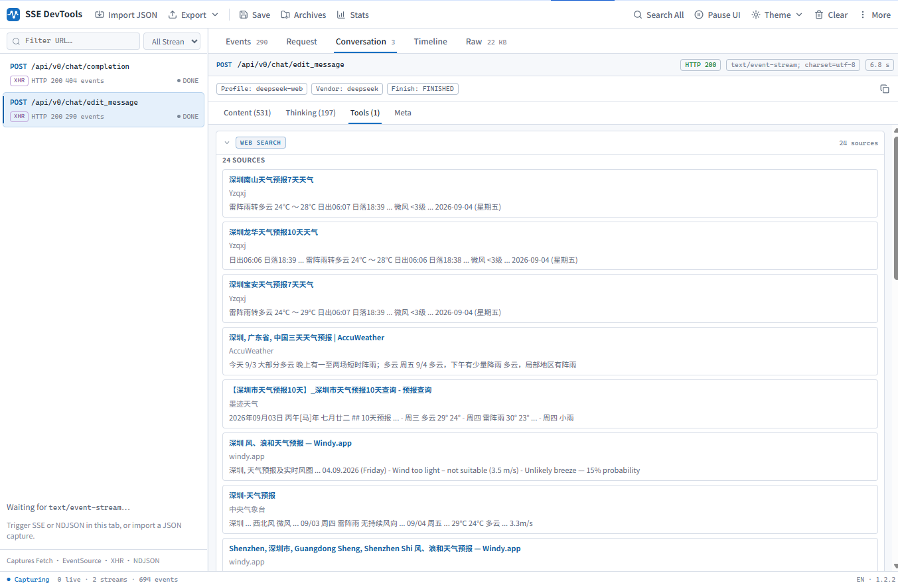
</p>

DeepSeek web example — Conversation merges thinking / content / search while the page streams:

<p align="center">
  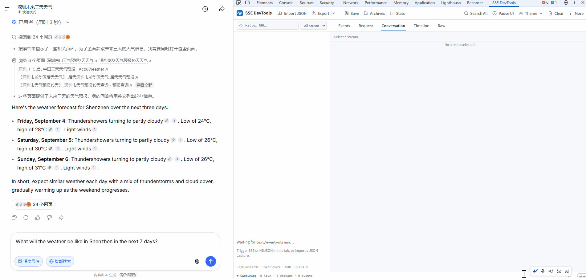
</p>

## ⏱ Timeline

Use the timeline to see when events arrived and how long gaps lasted:

- **Arrival track** — each event placed by arrival time; click to jump to the Events row
- **Stall highlight** — events with ≥250ms gap from the previous one are marked red
- **Gap distribution** — histogram of waits between adjacent events; long stalls stand out
- **Reconnect markers** — EventSource reconnects appear on the track, with reconnect count and Last-Event-ID

<p align="center">
  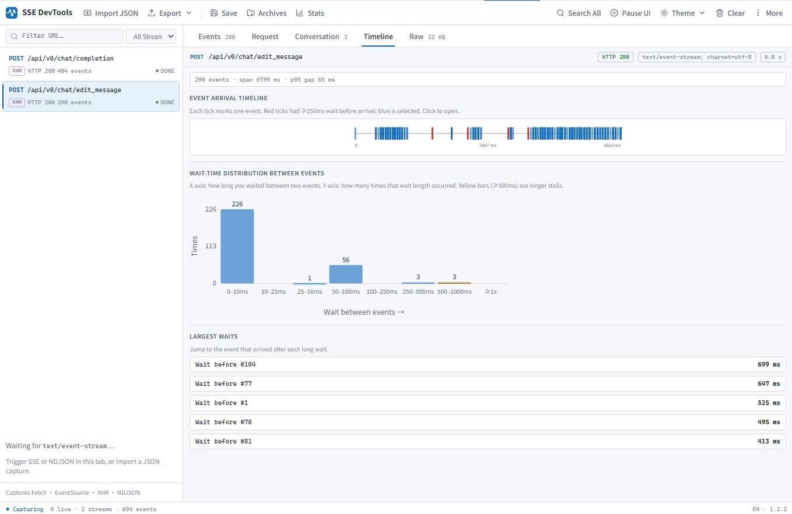
</p>

DeepSeek stream on the timeline — arrival cadence and stalls while the reply is still coming in:

<p align="center">
  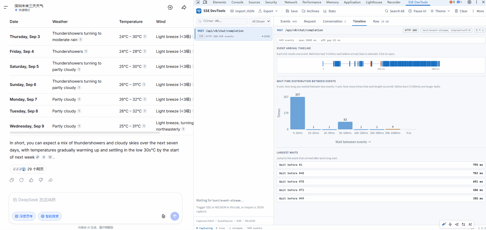
</p>

## 📄 Raw

View the stream text so you can compare it with Events / Conversation:

- Full text rebuilt from parsed events
- **Virtual scrolling** — longer Raw text stays steadier to scroll
- One-click copy

## ⚡ Virtual scrolling

While you debug a stream, the event list grows with each chunk, and Conversation / Raw can hold longer text. Drawing everything at once makes the panel feel heavy.

Events, Conversation (Content / Thinking), and Raw use virtual scrolling: off-screen content is drawn only when you scroll to it. The scrollbar still matches the full length, and live streams can stay pinned to the latest chunk.

<p align="center">
  
</p>

## 🛠 Analysis & toolbar

| Capability         | Description                                                                   |
| ------------------ | ----------------------------------------------------------------------------- |
| **Pause / Resume** | Pauses UI refresh only; capture keeps running; resume refreshes list & detail |
| **Stats**          | First-byte latency, duration, avg / max gap, events per second, and more      |
| **Anomalies**      | Scans empty data, odd gaps, and similar suspects                              |
| **Spec**           | SSE-spec hints for fields, newlines, BOM, and related issues                  |
| **Search All**     | Global search across streams                                                  |
| **Clear**          | Clears streams captured in the current session                                |
| **Settings**       | Opens the options page (language, etc.)                                       |

<p align="center">
  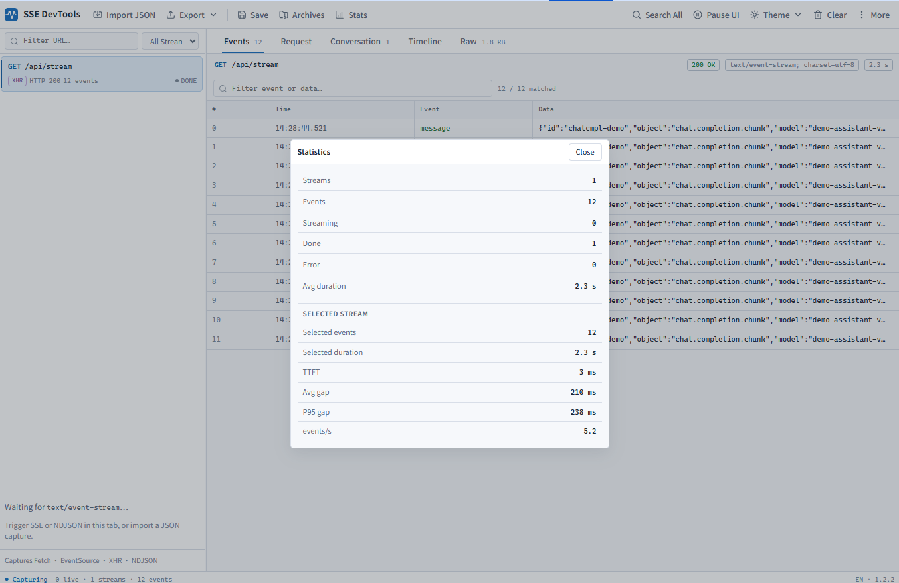
</p>

## 💾 Import / export / archives

- **Export** — JSON, CSV, or `.sse` text files
- **Import** — load a local JSON file and replay it in the panel
- **Save / Archives** — save the selected stream locally and open it again later

## 🌐 i18n & settings

- UI supports Chinese and English
- Options page: follow the browser language, or pin one language

---

# Screenshots

## Main workbench

Pick a stream in the sidebar; switch Events / Request / Conversation / Timeline / Raw on the right.

<p align="center">
  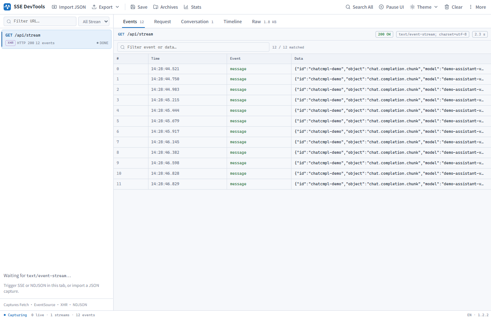
</p>

## Night theme

Same workbench in Night — switch Light / Night / Follow DevTools from the toolbar.

<p align="center">
  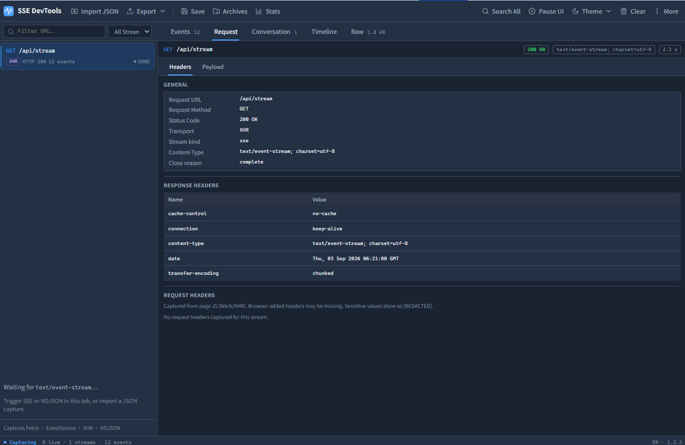
</p>

## Toolbar & More menu

Common actions live in the top bar: import, export, archives, Stats, pause, clear. Anomalies, Spec, global search, and settings are under **More**.

<p align="center">
  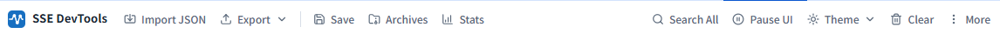
</p>

## Demo page

The local demo can start an SSE stream in one click, so you can confirm the extension is working.

<p align="center">
  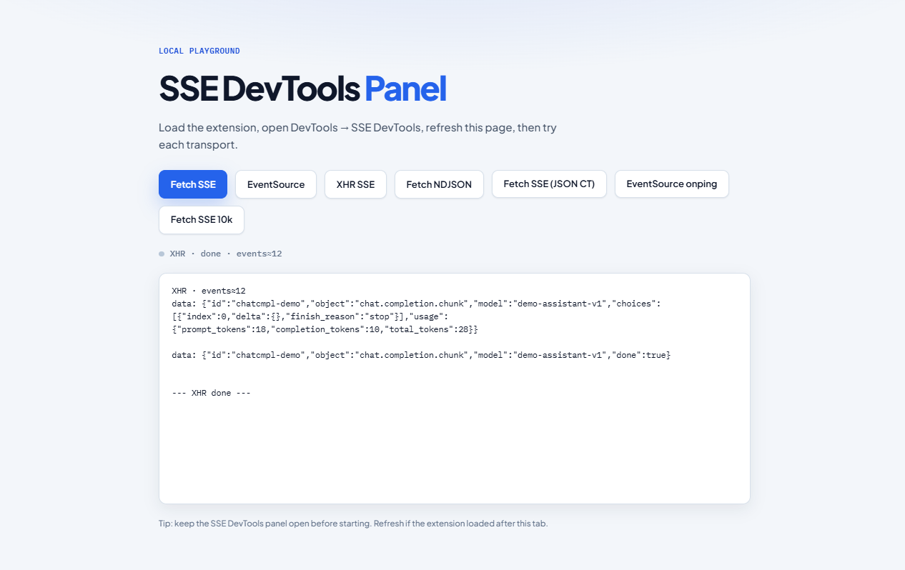
</p>

**Fetch SSE 10k** — stress a long stream and watch Events stay responsive with virtual scrolling:

<p align="center">
  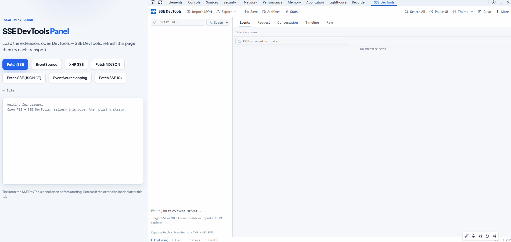
</p>

---

# Supported AI web vendors

Conversation merges content by protocol profile. Currently supported:

| Profile             | Typical site / shape    | Notes                                              |
| ------------------- | ----------------------- | -------------------------------------------------- |
| `openai-compatible` | OpenAI-compatible APIs  | Content / thinking / tool calls                    |
| `deepseek-web`      | DeepSeek web            | Thinking + content; search tools                   |
| `doubao-web`        | Doubao web              | Split thinking / content; deduped sources          |
| `kimi-web`          | Kimi                    | Thinking / content / search                        |
| `qwen-web`          | Qwen web                | Plan thinking / deep thinking / search             |
| `chatglm-web`       | ChatGLM / Zhipu Qingyan | Thinking / content / search results                |
| `yuanbao-web`       | Tencent Yuanbao         | Deep-search thinking + sources                     |
| `anthropic`         | Anthropic-style SSE     | Profile detection only — no Conversation merge yet |
| `generic`           | Unrecognized            | Events / Timeline / Raw still work                 |

> Vendor protocols change often. If Conversation is empty or tool cards look wrong, export Raw or JSON and include the URL.  
> Sites not listed here are adapted after we have a real sample.  
> CI regression samples: [`fixtures/vendors/`](./fixtures/vendors/).

---

# Quick start

### Prerequisites

- Node.js 20+ (`engines`; CI uses Node.js 22)
- [pnpm](https://pnpm.io) 10.x (see the `packageManager` field)
- A Chromium-based browser (Chrome / Edge / …)

### Install & load

**Recommended:** install from the [Chrome Web Store](https://chromewebstore.google.com/detail/sse-devtools-panel/kffpkefnkmabnkhklmnjkihiiclggnni) or [Microsoft Edge Add-ons](https://microsoftedge.microsoft.com/addons/detail/sse-devtools-panel/jmdceeplcpkajkiaiankkabblekdehmf), then open your page → <kbd>F12</kbd> → **SSE DevTools** → **refresh the page** before triggering a stream.

**From source** (development / local build):

```bash
git clone https://github.com/FatMii/sse-devtools-panel.git
cd sse-devtools-panel
pnpm i
pnpm build
```

1. Open `chrome://extensions` or `edge://extensions` and enable **Developer mode**
2. **Load unpacked** → select the repo’s **`dist/`** folder
3. Open the target site → <kbd>F12</kbd> → **SSE DevTools**
4. **Refresh the page**, then trigger a streaming API (the extension must be active at page load)

While coding, use `pnpm dev` for watch builds, then click **Reload** on the extensions page.

#### Self-hosted CRX on managed Windows Chrome

If you distribute a signed CRX from your own update endpoint, recent Chrome versions may disable it as an unverified external extension unless the extension is explicitly allowed by enterprise policy.

Run the following from an elevated Command Prompt, replacing the placeholders with your own extension ID and update manifest URL:

```bat
reg add "HKLM\SOFTWARE\Policies\Google\Chrome\ExtensionInstallAllowlist" /v 1 /t REG_SZ /d <EXTENSION_ID> /f
reg add "HKLM\SOFTWARE\Policies\Google\Chrome\ExtensionInstallForcelist" /v 1 /t REG_SZ /d "<EXTENSION_ID>;<UPDATE_XML_URL>" /f
```

For example, `<UPDATE_XML_URL>` can point to a self-hosted `updates.xml` whose update entry references the signed `.crx` file. Keep the extension ID stable by signing releases with the same key. For reliable subsequent updates, also put the same `update_url` in the extension manifest, or deploy `ExtensionSettings` with `override_update_url: true`; otherwise Chrome can use the manifest's update URL after the initial policy installation.

Then:

1. Open `chrome://policy/`
2. Click **Reload policies**
3. Confirm `ExtensionInstallAllowlist` and `ExtensionInstallForcelist` both contain the expected extension ID
4. Open `chrome://extensions/` and verify that the extension is enabled and managed

This approach avoids requiring the Chrome Web Store while still using Chrome's managed-extension policy path. Administrator rights are required to write the machine-level policy keys.

#### Self-hosted CRX on managed macOS Chrome

On macOS, Chrome policies are deployed through the `com.google.Chrome` preference domain, normally as a configuration profile (`.mobileconfig`). For new deployments, prefer `ExtensionSettings`; it takes precedence over the legacy `ExtensionInstallForcelist` policy.

Add the following policy to your `com.google.Chrome.plist` or equivalent MDM configuration, replacing the placeholders with your own extension ID and update endpoint:

```xml
<key>ExtensionSettings</key>
<dict>
  <key>EXTENSION_ID</key>
  <dict>
    <key>installation_mode</key>
    <string>force_installed</string>
    <key>update_url</key>
    <string>UPDATE_XML_URL</string>
    <key>override_update_url</key>
    <true/>
  </dict>
</dict>
```

`force_installed` installs the extension automatically and prevents users from removing or disabling it. `override_update_url` keeps subsequent updates on the policy-specified update endpoint instead of falling back to an update URL embedded in the extension manifest.

To deploy locally or through MDM:

1. Put the policy in `com.google.Chrome.plist`
2. Convert it to an installable `com.google.Chrome.mobileconfig` profile, or configure the same keys directly in your MDM
3. Install/deploy the profile and restart Chrome
4. Open `chrome://policy/` and click **Reload policies**
5. Confirm `ExtensionSettings` contains the expected extension ID
6. Open `chrome://extensions/` and verify that the extension is installed and managed

Google's Chrome Browser Enterprise bundle includes a sample `com.google.Chrome.plist`. Its macOS quick-start guide also documents converting that plist into `com.google.Chrome.mobileconfig` for deployment.

Legacy policy deployments can use the older pair below, but `ExtensionSettings` is preferred for new setups:

```xml
<key>ExtensionInstallAllowlist</key>
<array>
  <string>EXTENSION_ID</string>
</array>
<key>ExtensionInstallForcelist</key>
<array>
  <string>EXTENSION_ID;UPDATE_XML_URL</string>
</array>
```

More collaboration notes: [CONTRIBUTING.md](./CONTRIBUTING.md).

---

# 30-second demo

```bash
pnpm build && pnpm demo
```

1. Open <http://127.0.0.1:8765>
2. Confirm the extension is loaded → open DevTools → **SSE DevTools**
3. **Refresh the demo page** → try **Fetch SSE**, **EventSource**, **XHR SSE**, **Fetch NDJSON**, **Fetch SSE (JSON CT)**, or **EventSource onping**
4. A stream should appear in the sidebar; Events / Conversation / Timeline / Raw tabs should have data

---

# Development

```bash
pnpm build        # typecheck + bundle into dist/
pnpm dev          # watch build
pnpm typecheck
pnpm lint
pnpm format
pnpm test         # Vitest unit tests (src/**/__tests__/**/*.test.ts)
pnpm test:watch   # Vitest watch mode
```

| Path                         | Role                                                      |
| ---------------------------- | --------------------------------------------------------- |
| `src/content/inject/`        | Page-side capture: fetch / EventSource / XHR patches      |
| `src/content/inject-main.ts` | Inject entry (loads the patches above)                    |
| `src/content/bridge.ts`      | Forwards captured data into the extension                 |
| `src/background.ts`          | Extension background message relay                        |
| `src/devtools/`              | DevTools panel registration                               |
| `src/panel/`                 | Panel UI (`core` / `views` / `features` / `widgets`)      |
| `src/shared/`                | Shared parsers, timing, Spec, export, and related helpers |
| `src/shared/ai-merge/`       | Conversation merge (per-vendor profiles)                  |
| `src/options/`               | Options page                                              |
| `_locales/`                  | UI strings (`en` / `zh_CN`)                               |
| `demo/`                      | Local demo server                                         |
| `scripts/`                   | Build and test scripts                                    |

Before opening a PR, run:

```bash
pnpm format:check && pnpm lint && pnpm test && pnpm typecheck && pnpm build
```

---

# Limitations

- Chromium DevTools only (Chrome / Edge / …); no Firefox / Safari panel yet
- Requests started inside a page Service Worker are not captured
- Some deeper streaming API patterns may be missed; open an Issue with repro steps if you hit one
- How we decide a response is a stream: first check the response `Content-Type` for real stream types (`text/event-stream`, NDJSON, Connect+JSON). Many AI gateways mislabel or omit it — the body is still SSE, but the header says `application/json` / `text/plain`, or there is no `Content-Type` at all. In those cases we also look at the request: `Accept: text/event-stream`, a JSON body with `"stream": true`, or `?stream=true` on the URL. The demo button **Fetch SSE (JSON CT)** is that case (JSON response header + `stream: true` in the body). Ordinary JSON APIs without those hints are still ignored. If the request already has those stream hints, a row appears in the Streams list immediately while the response is still pending; a provisional row is removed if the response turns out not to be a stream
- Conversation depends on each site’s private protocol and may need updates after site changes
- If the SSE panel opens after a stream already started, the background service worker replays a recent buffer (up to ~2 000 messages / ~4 MB per tab). Older traffic may be dropped when the cap is hit; an extension service-worker restart can still clear the buffer

---

# Changelog

Release history lives in [CHANGELOG.md](./CHANGELOG.md) (Keep a Changelog). Tagged builds and offline zips are on [GitHub Releases](https://github.com/FatMii/sse-devtools-panel/releases).

---

# Contributing

Issues and PRs are welcome. Please read [CONTRIBUTING.md](./CONTRIBUTING.md) first.

When reporting a bug, include repro steps, Chrome version, target URL, and whether the local demo reproduces it. For Conversation issues, attach Raw or exported JSON (redacted is fine).

For vendor adaptations, please include a real sample so we can match protocol changes.

---

# Acknowledgments

- **UI icons** — adapted from [Lucide](https://lucide.dev) ([ISC](https://lucide.dev/license)). New icons should also come from Lucide; see [CONTRIBUTING.md](./CONTRIBUTING.md).
- **Onboarding tour** — [driver.js](https://driverjs.com) ([MIT](https://github.com/kamranahmedse/driver.js/blob/master/license)).
- **Platform** — built as a Chromium DevTools extension.
- **Protocols** — SSE follows the [HTML Living Standard](https://html.spec.whatwg.org/multipage/server-sent-events.html); Connect+JSON framing follows the [Connect protocol](https://connectrpc.com/docs/protocol).

---

# License

This project is released under the **[MIT](./LICENSE)** license.
